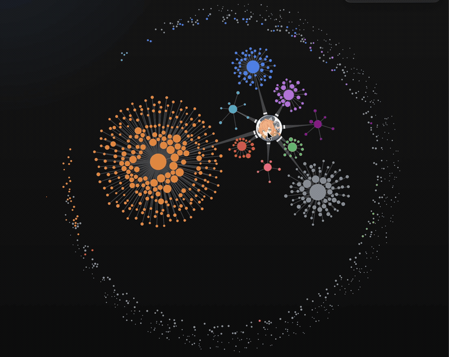
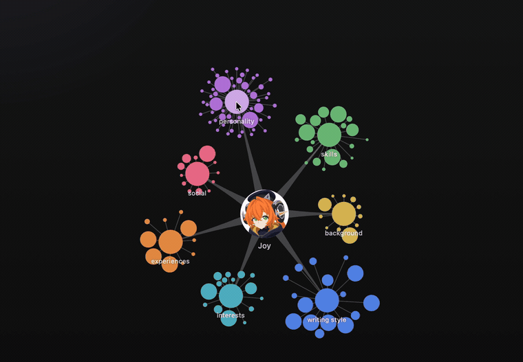
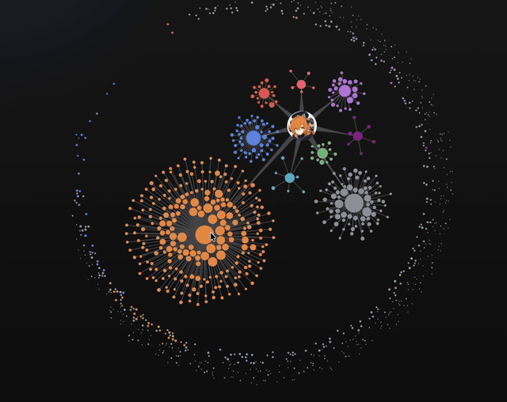

<div align="center">
  

  <h1>My Portrait</h1>

  <p><b>A local-first AI memory system for macOS.</b></p>

  <p>It quietly captures your screen, voice, and writing — and builds your external memory and a personal portrait out of them, automatically. <b>Everything stays on your Mac.</b></p>

  <a href="https://github.com/joyzhang14-14/My-Portrait/releases/latest">
    
  </a>
</div>

---

## What it does

- **Captures your day** — screen (OCR), microphone + system audio, and what you actually type, continuously and silently in the background.
- **Transcribes on-device** — Whisper or Qwen3-ASR with speaker diarization. No audio ever leaves your Mac.
- **Knows what you wrote** — separates words you really typed from pasted text and half-finished drafts, down to the keystroke.
- **Builds a portrait** — raw activity is distilled into events, then into an evolving picture of your interests, habits, personality and writing style.
- **Walk your Neural Graph** — your memories as a living map, with you at the center, instead of a list of files.
- **Search it all** — full-text across everything you've seen, said, and written.
- **Yours, locally** — all data sits under `~/.portrait/` on this Mac (SQLite + plain files). No account, no server, nothing to sign up for.

## The Neural Graph

You sit at the center. The areas of your life grow into their own clusters around you, and individual memories gather where they belong. Selecting, dragging and switching views are all physical — the graph settles rather than snaps.

<table>
  <tr>
    <td width="50%" align="center">
      <br/>
      <sub><b>Lighting up a memory</b> — select one and its connections come alive.</sub>
    </td>
    <td width="50%" align="center">
      <br/>
      <sub><b>Portrait → Personality</b> — the same memories, seen through a different lens.</sub>
    </td>
  </tr>
  <tr>
    <td colspan="2" align="center">
      <br/>
      <sub><b>Drag a folder and let go</b> — the whole system finds its way home.</sub>
    </td>
  </tr>
</table>

## Install

1. Download the `.dmg` from [the latest release](https://github.com/joyzhang14-14/My-Portrait/releases/latest).
2. The app is self-signed, so Gatekeeper will block it. Pick one:

   **Option A — strip quarantine (no prompts):**

   ```bash
   xattr -dr com.apple.quarantine ~/Downloads/MyPortrait_*.dmg
   ```

   Open the DMG, drag **My Portrait** into `Applications` — first launch just works.

   **Option B — approve once:**
   Open the DMG, drag into `Applications`, then **right-click the app → Open → Open** in the warning dialog.

> **Requires an Apple silicon Mac with 16 GB of memory, on macOS 15 or later.** Updates ship automatically via [Sparkle](https://sparkle-project.org).

## Configuration

Tune everything in the app's Settings, or edit `~/.portrait/config.toml` directly — the two stay in sync. All your data lives under `~/.portrait/`.

## Where it's going

**Capture is already fully local.** Screen OCR, audio transcription and speaker diarization all run on your Mac and always have. Raw keystrokes never leave it either.

**The understanding layers are not, yet.** Turning a day into events, working out what you actually wrote, distilling the portrait, learning personality and writing style — these currently call out to a cloud LLM with your own API key. That is the one thing left to fix.

The goal is a memory system with **no cloud API at all**: every step, end to end, on an Apple silicon Mac with 16 GB of memory. Work in progress toward that:

- local models sized to fit 16 GB alongside everything else that's running;
- telling apart what was merely _on screen_ from what you were actually _doing_;
- keeping memories anchored to real evidence instead of inventing the missing parts.

This project stays focused on one thing: the memory system.

## Acknowledgements

My Portrait's screen capture draws on the approach worked out by **[screenpipe](https://github.com/mediar-ai/screenpipe)** — how to record a screen around the clock without getting in the way. Thanks to mediar-ai for figuring that part out in the open.

Everything past that point goes its own way, because the two projects want different things. screenpipe is a general context layer for developers to build products on. My Portrait is one finished, opinionated thing: a memory system that turns your days into a portrait of you. If the general layer is what you're after, go use screenpipe.

## Credits

- **[screenpipe](https://github.com/mediar-ai/screenpipe)** — screen capture approach.
- **[WhisperKit](https://github.com/argmaxinc/WhisperKit)** · **[Qwen3-ASR](https://github.com/ivan-digital/qwen3-asr-swift)** · **[mlx-swift](https://github.com/ml-explore/mlx-swift)** · **[GRDB](https://github.com/groue/GRDB.swift)** — on-device AI on macOS, made practical.

---

<div align="center">
  <sub>Building from source or contributing? See <a href="DEVELOPER.md">DEVELOPER.md</a>.</sub>
</div>
