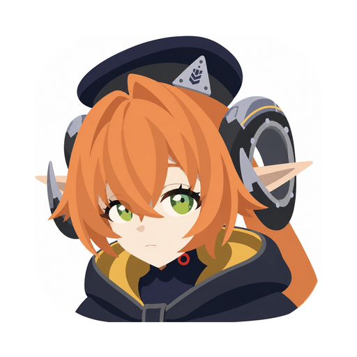
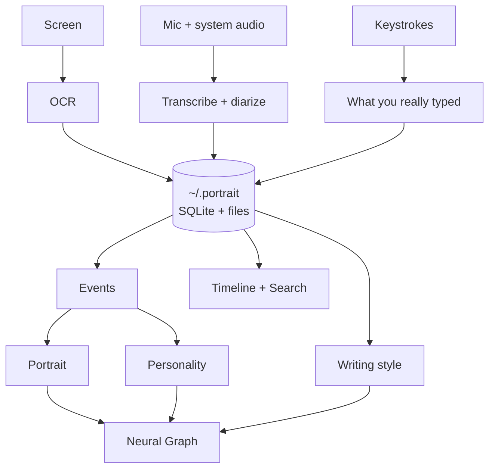
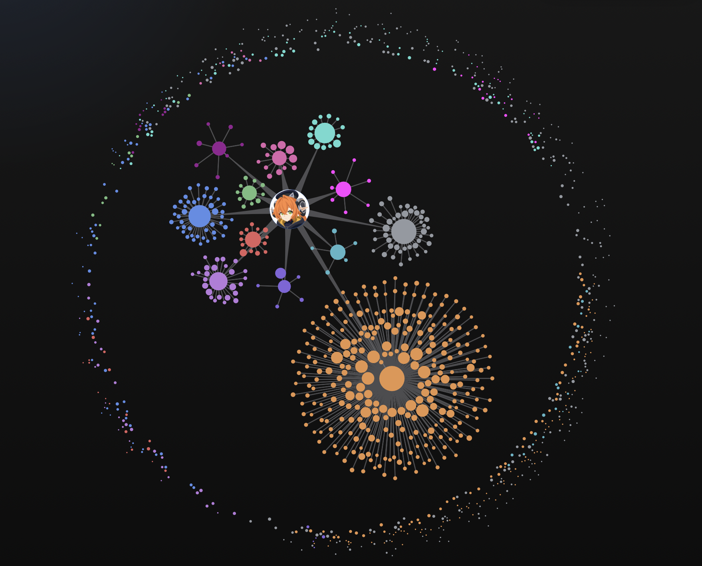
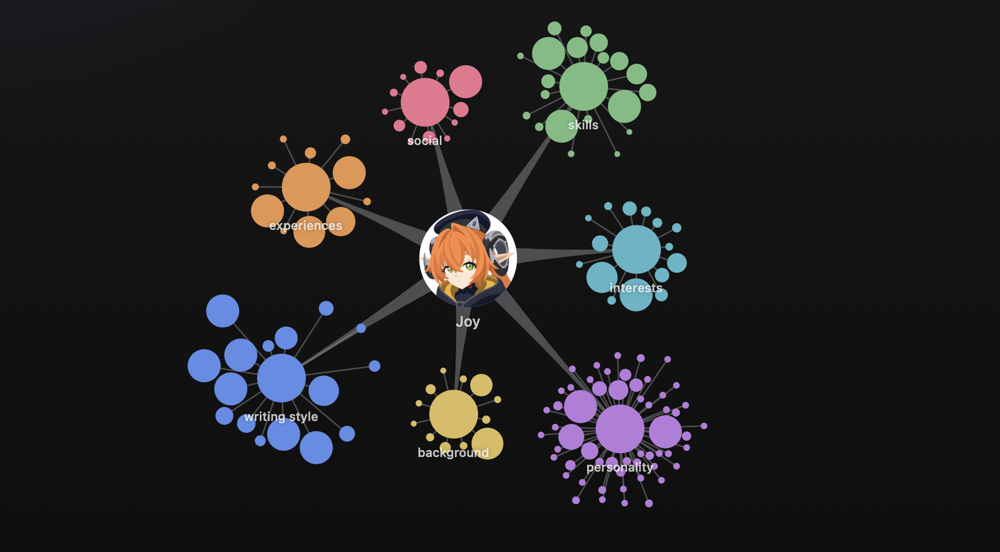

<div align="center">
  

  <h1>My Portrait</h1>

  <p><b>A local-first AI memory system for macOS.</b></p>

  <p>It quietly captures your screen, voice, and writing — and builds your external memory and a personal portrait out of them, automatically. <b>Everything stays on your Mac.</b></p>

  <a href="https://github.com/joyzhang14-14/My-Portrait/releases/latest">
    
  </a>
</div>

---

## How it works


```mermaid
flowchart TB
  A1["Screen"] --> B1["OCR"]
  A2["Mic + system audio"] --> B2["Transcribe + diarize"]
  A3["Keystrokes"] --> B3["What you really typed"]

  B1 --> DB[("~/.portrait<br/>SQLite + files")]
  B2 --> DB
  B3 --> DB

  DB --> E["Events"]
  E --> P["Portrait"]
  E --> PS["Personality"]
  DB --> WS["Writing style"]

  P --> G["Neural Graph"]
  PS --> G
  WS --> G
  DB --> TL["Timeline + Search"]
```

## The Neural Graph

Over time, My Portrait builds a memory and a portrait that belong only to you, out of what it sees and the algorithms built into it.

<div align="center">
  <br/>
  <sub>Memory graph, after My Portrait had been running on my Mac for 3 months.</sub>
</div>

<div align="center">
  <br/>
  <sub>Portrait graph, after 3 months of running.</sub>
</div>

## Install

1. Download the `.dmg` from [the latest release](https://github.com/joyzhang14-14/My-Portrait/releases/latest).
2. The app is self-signed, so Gatekeeper will block it. Pick one:

   **Option A — strip quarantine (no prompts):**

   ```bash
   xattr -dr com.apple.quarantine ~/Downloads/MyPortrait_*.dmg
   ```

   Open the DMG, drag **My Portrait** into `Applications` — first launch just works.

   **Option B — approve once:**
   Open the DMG, drag into `Applications`, then **right-click the app → Open → Open** in the warning dialog.

> **Requires an Apple silicon Mac with 16 GB of memory, on macOS 15 or later.** Updates ship automatically via [Sparkle](https://sparkle-project.org).

## Configuration

Tune everything in the app's Settings, or edit `~/.portrait/config.toml` directly — the two stay in sync. All your data lives under `~/.portrait/`.

## Where it's going

**Capture is already fully local.** Screen OCR, audio transcription and speaker diarization all run on your Mac and always have. Raw keystrokes never leave it either.

**The understanding layers are not, yet.** Turning a day into events, working out what you actually wrote, distilling the portrait, learning personality and writing style — these currently call out to a cloud LLM with your own API key. That is the one thing left to fix.

The goal is a memory system with **no cloud API at all**: every step, end to end, on an Apple silicon Mac with 16 GB of memory. Work in progress toward that:

- local models sized to fit 16 GB alongside everything else that's running;
- telling apart what was merely _on screen_ from what you were actually _doing_;
- keeping memories anchored to real evidence instead of inventing the missing parts.

This project stays focused on one thing: the memory system.

## Acknowledgements

My Portrait's screen capture, audio capture, and timeline all draw on the approach worked out by **[screenpipe](https://github.com/mediar-ai/screenpipe)** — how to record continuously in the background without getting in the way, and how to turn a day of raw activity into something you can scroll back through. Thanks to mediar-ai for working that out in the open, and go take a look at what they're building.

## Credits

- **[screenpipe](https://github.com/mediar-ai/screenpipe)** — screen capture, audio capture, and timeline approach.
- **[WhisperKit](https://github.com/argmaxinc/WhisperKit)** · **[Qwen3-ASR](https://github.com/ivan-digital/qwen3-asr-swift)** · **[mlx-swift](https://github.com/ml-explore/mlx-swift)** · **[GRDB](https://github.com/groue/GRDB.swift)** — on-device AI on macOS, made practical.

---

<div align="center">
  <sub>Building from source or contributing? See <a href="DEVELOPER.md">DEVELOPER.md</a>.</sub>
</div>
